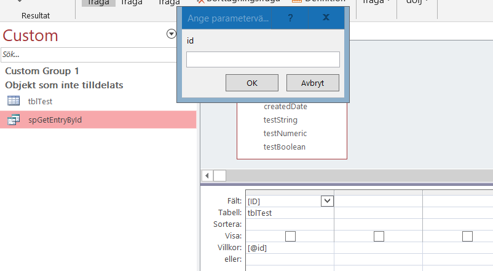
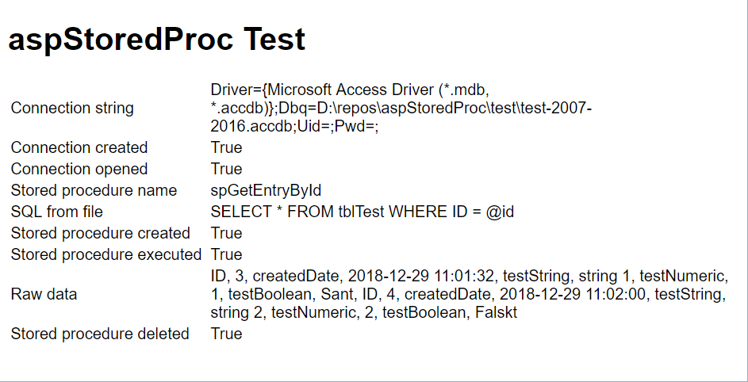

# ASP Stored Procedure Class 1.3

This class encapsulates the creation, execution and deletion of stored procedures ([SP][sp]) for the MS Access database using [ASP Classic][asp]. It also supports loading of the SQL-statement that defines the SP from an external SQL-file.

## How to use

### Creating a database connection

To use the ADO specific constants, such as <em>adModeReadWrite</em> and <em>adUseClient</em>, you must also include `adovbs.inc`.

```vb
' The first thing to do is to open a database connection
Dim objCn, strConn
strConn = getConnectionString()
Set objCn = Server.CreateObject("ADODB.Connection")

objCn.Mode = adModeReadWrite  ' Important that we specify write access when creating a stored procedure
objCn.CommandTimeout = 10
objCn.CursorLocation = adUseClient  ' or adUseServer
objCn.Open strConn

Function getConnectionString()
  ' Provide a database connection string (this needs to be installed on your system)
  getConnectionString = "Driver={Microsoft Access Driver (*.mdb, *.accdb)};Dbq=" & Server.MapPath("test-accdb-2007-2016.accdb") & ";Uid=;Pwd=;"
End Function
```

### Executing a stored procedure in the database

```vb

' To execute a store procedure named spGetEntryById
Dim objSP
Set objSP = New CStoredProc
objSP.Name = "spGetEntryById"
objSP.AddParam "@id", "LONG", 1
objSP.Execute objCn, objRs
Set objRs = objSP.Execute(objCn)
Set objSP = Nothing

If Err.Number = 0 Then
	objRs.MoveFirst()
  If Err.Number = 0 Then
    While Not(objRs.EOF)
      ' Do something...
      objRs.MoveNext()
    Wend
  Else
    ' No records ...
  End If
Else
  ' An error occured...
End If

Set objRs = Nothing
```

To execute the same stored procedure but with a different parameter value, use
```vb 
objSP.SetParam "@id", 2
Set objRs = objSP.Execute(objCn)
```

### Writing a stored procedure to the database

Here is how to programmatically create a stored procedure. All parameters are prefixed with `@`.

```vb
Dim strSql, objSP
strSql = "SELECT * FROM tblTest WHERE id = @id"
Set objSP = New CStoredProc
objSP.Name = "spGetEntryById"
objSP.SQL = strSql
objSP.Create objCn
Set objSP = Nothing
```

Never use the same `CStoredProc` object to create different stored procedures, but use a code structure as follows.

```vb
Set objSP = New CStoredProc
  ' do some stuff...
Set objSP = Nothing

Set objSP = New CStoredProc
  ' do some stuff...
Set objSP = Nothing
```

Longer and more complex SQL-statements can be read from a separate SQL file to avoid the additional overhead involved when concatenating strings and to improve code readability. Use the following code to load the SQL-statement from an exeternal file to create a stored procedure:

```vb
Set objSP = New CStoredProc
objSP.Name = "spGetEntryById"
objSP.LoadSQL "./" ' assumes that spGetEntryById.sql exists in the current folder
' objSP.LoadSQL "./spGetEntryById.sql"
objSP.Create objCn
Set objSP = Nothing
```

If we open our Access database we can ensure that the stored procedure has been created.



### Deleting a stored procedure from the database

```vb
Set objSP = New CStoredProc
objSP.Name = "spGetEntryById"
objSP.Delete objCn
Set objSP = Nothing
```

## Test results



## Class CStoredProc

### Properties

> * Name (Read/Write)
> * CommandText (Read-only)
> * SQL (Read/Write)

### Methods

> * AddParam(name, type, value) 
> * SetParam(name, value)
> * RemoveParams()
> * LoadSQL(path): Boolean
> * Create(objCn:ADODB.Connection): Boolean
> * Execute(objCn:ADODB.Connection): ADODB.Recordset
> * Delete(objCn:ADODB.Connection): Boolean

## Version history

### Version 1.3, 2018-12-29
> * Removed unused code, added test code and and made it publically available

### Version 1.2, 2012-12-27
> * The Execute method now surrounds input arguments by 'value' except for the data types `BYTE`, `TINYINT`, `INTEGER`, `LONG`. It also replaces the value with `NULL` if `IsNull(value)` returns `true`. This solved an issue when trying to insert an emtpy string with a stored procesudre call.

Version 1.1, 2012-12-26
> * `Create`, `Delete` and `LoadSQL` return `TRUE` on success, otherwise `FALSE`.
Use the following code to execute the stored procedure: `Set objRs = objSP.Execute(objCn)`

### Version 1.0, 2012-12-23
> * First implementation

## Related links

>* [VBScript ADO Programming][ado]

[sp]: https://en.wikipedia.org/wiki/Stored_procedure
[asp]: https://en.wikipedia.org/wiki/Active_Server_Pages
[ado]: https://docs.microsoft.com/en-us/sql/ado/guide/appendixes/vbscript-ado-programming?view=sql-server-2017
